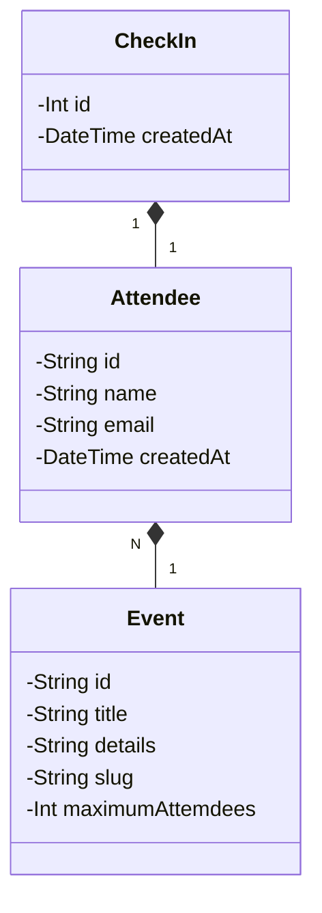

[JAVA_BADGE]: https://img.shields.io/badge/java-%23ED8B00.svg?style=for-the-badge&logo=openjdk&logoColor=white
[SPRING_BADGE]: https://img.shields.io/badge/spring-%236DB33F.svg?style=for-the-badge&logo=spring&logoColor=white
[SPRINGBOOT_BADGE]: https://img.shields.io/badge/springboot-%236DB33F.svg?style=for-the-badge&logo=springboot&logoColor=white
[GIT_BADGE]: https://img.shields.io/badge/git-%23F05033.svg?style=for-the-badge&logo=git&logoColor=white
[GITHUB_BADGE]: https://img.shields.io/badge/github-%23121011.svg?style=for-the-badge&logo=github&logoColor=white
[FLYWAY_BADGE]: https://img.shields.io/badge/flyway-CC0200.svg?style=for-the-badge&logo=flyway&logoColor=white
[MAVEN_BADGE]: https://img.shields.io/badge/apachemaven-C71A36.svg?style=for-the-badge&logo=apachemaven&logoColor=white
[TOMCAT_BADGE]: https://img.shields.io/badge/apachetomcat-F8DC75.svg?style=for-the-badge&logo=apachetomcat&logoColor=black

<h1 align="center" style="font-weight: bold;">Conf Manager 💻</h1>

![spring][SPRING_BADGE]
![java][JAVA_BADGE]
![springboot][SPRINGBOOT_BADGE]
![git][GIT_BADGE]
![github][GITHUB_BADGE]
![flyway][FLYWAY_BADGE]
![maven][MAVEN_BADGE]
![tomcat][TOMCAT_BADGE]

<p align="center">
 <a href="#started">Getting Started</a> • 
  <a href="#routes">API Endpoints</a> •
 <a href="#colab">Collaborators</a> •
 <a href="#contribute">Contribute</a>
</p>

<h2 align="center">
  <b>Conf Manager is a Rest API for management of events or conferences
</h2>

<h3>Prerequisites</h3>

List of prerequisites necessary for running the project

- [Java 17](https://openjdk.org/install/)
- [Maven](https://maven.apache.org/download.cgi)

<h3>Dependencies</h3>

List of dependencies of the project

- Spring Boot 3.2.3
- Spring Web
- Spring Boot DevTools
- Spring Data JPA
- Flyway Migration
- Lombok
- HyperSQL

<h2 id="started">🚀 Getting started</h2>

How to run the project locally:

<h3>Cloning</h3>

How to clone the project

```bash
git clone https://github.com/lucashemanuel/conf-manager.git
```

<h3>Starting</h3>

How to start the project

```bash
cd conf-manager
mvn spring-boot:run
```

The app will start running at <http://localhost:8080>.

<h2>Entity Relationship Model</h2>



<h2 id="routes">📍 API Endpoints</h2>

Main routes of the API
​
| route | description  
|----------------------|-----------------------------------------------------
| <kbd>POST /attendees/{attendeeId}/check-in</kbd> | to do the event check in
| <kbd>GET /attendees/{attendeeId}/badge</kbd> | to view the participant badge
| <kbd>POST /events/{eventId}/attendees</kbd> | to create a participant
| <kbd>GET /events/attendees/{id}</kbd> | to get the participants of the event
| <kbd>POST /events</kbd> | to create a event
| <kbd>GET /events/{id}</kbd> | to get details of a event

## API Documentation for testing endpoints (Swagger)

### https://app.swaggerhub.com/apis/lucashemanuel/ConfManagerAPI/1.0.0

<h2 id="colab">🤝 Collaborators</h2>

People that contributed for this project

<table>
  <tr>
    <td align="center">
      <a href="#">
        <br>
        <sub>
          <b>Lucas Hemanuel</b>
        </sub>
      </a>
    </td>
  </tr>
</table>

<h2 id="contribute">📫 Contribute</h2>

How to contribute to the project

1. `git clone https://github.com/lucashemanuel/conf-manager.git`
2. `git checkout -b feature/NAME`
3. Follow commit patterns
4. Open a Pull Request explaining the problem solved or feature made, if exists, append screenshot of visual modifications and wait for the review!

<h3>Documentations that might help</h3>

[📝 How to create a Pull Request](https://www.atlassian.com/br/git/tutorials/making-a-pull-request)

[💾 Commit pattern](https://gist.github.com/joshbuchea/6f47e86d2510bce28f8e7f42ae84c716)
